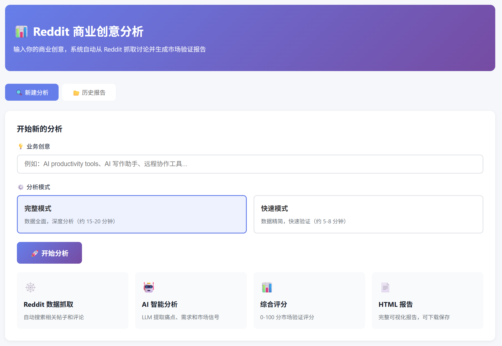
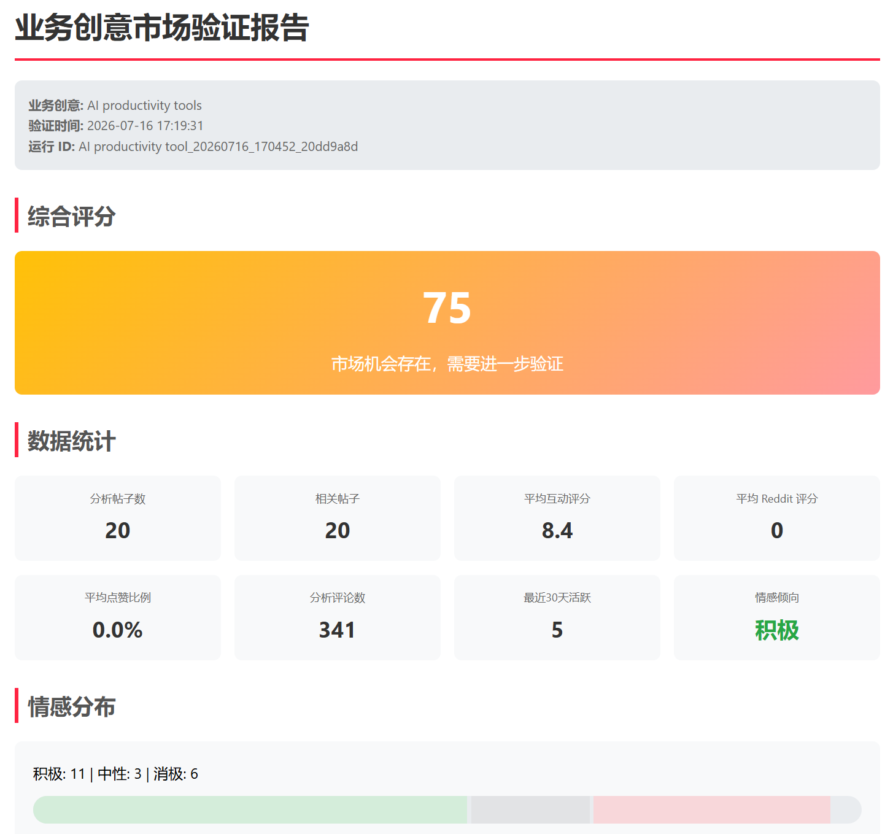
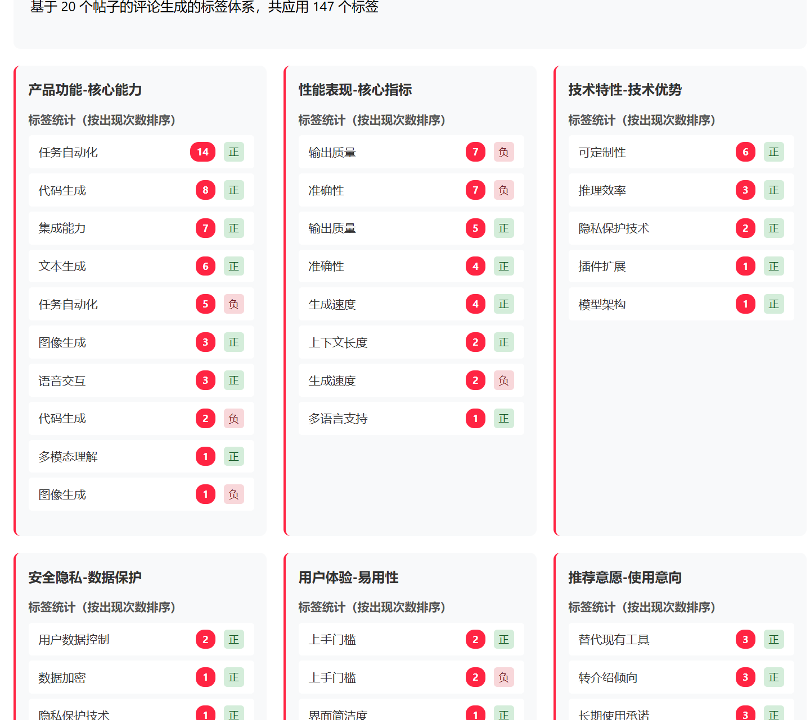

# Reddit\_Business\_Idea\_Validator Reddit 商机解析智能体

## 📋 项目概述

Reddit 收集和分析数据来解析市场需求、用户痛点及竞争格局
深度！评论分析！用户画像！找商机！

为什么找市场机会选择 Reddit？
商机在具体的问题里！

Reddit 汇聚着包罗万象的生活问题和经验分享，是年轻人常用的决策路径，他们相信能在这里找到答案。

对商家而言，要想深入了解今年的消费者在苦恼些什么、真正需要些什么，Reddit 是必经之路。

消费者不是没有需求，而是需求太具体。

<br />

**AI 代理化身你的私人创投分析师**——从创业点子脑暴，到完整验证，再到 Go-to-Market 落地策略，一站式包办。专为"宁可 10 分钟验证、不愿 6 个月后悔"的生意人打造。 

&#x20;

这款工具组合调用 Reddit API 与 AI 模型（OpenAI 或 Deepseek等）来实现：

1. **抓取**相关 subreddit，覆盖科技、金融、育儿、健身、商业等多领域讨论
2. **识别**那些流露出真实痛点、具备产品化潜力的帖子
3. 用**多维度指标**（技术深度、可落地性、情绪强度等）对帖子**打分分析**
4. 结果存入**本地 Json 数据库**供查阅
5. 通过**交互式 Web 仪表盘**浏览和筛选结果

<br />

### 使用方法：

**命令行**: `python run_agent.py "AI productivity tools" --fast`

**Web 界面**: `python app.py` → 浏览器访问 <http://localhost:5000>





### 核心功能

- 📊 **Reddit 数据抓取**: 自动抓取相关帖子和评论数据（使用用户输入作为搜索关键词）
- 🤖 **AI 内容分析**: 使用 LLM 分析用户痛点和市场需求
- 📄 **自动化报告生成**: 生成专业的市场验证报告

### 系统流程图

```
┌─────────────────────────────────────────────────────────────────────────────────┐
│                              系统入口                                         │
│                    python run_agent.py "业务创意"                              │
└─────────────────────────────────────────────────────────────────────────────────┘
                                           │
                                           ▼
┌─────────────────────────────────────────────────────────────────────────────────┐
│                           环境配置与初始化                                      │
│  ┌─────────────┐  ┌─────────────┐  ┌─────────────┐  ┌─────────────┐           │
│  │  Config     │  │ Context     │  │ MCP Clients │  │ Storage     │           │
│  │  Manager    │  │  Store      │  │             │  │  Server     │           │
│  └─────────────┘  └─────────────┘  └─────────────┘  └─────────────┘           │
└─────────────────────────────────────────────────────────────────────────────────┘
                                           │
                                           ▼
┌─────────────────────────────────────────────────────────────────────────────────┐
│                        Orchestrator Agent 启动                                │
│  ┌─────────────────────────────────────────────────────────────────────────┐   │
│  │ 任务: validate_business_idea                                           │   │
│  │ 业务创意: "用户输入的业务创意"                                          │   │
│  └─────────────────────────────────────────────────────────────────────────┘   │
└─────────────────────────────────────────────────────────────────────────────────┘
                                           │
                                           ▼
┌─────────────────────────────────────────────────────────────────────────────────┐
│                        1. 数据抓取阶段 (Scraper Agent)                         │
│  ┌─────────────────────────────────────────────────────────────────────────┐   │
│  │ 任务: scrape_data                                                     │   │
│  │ - 使用业务创意作为搜索关键词                                           │   │
│  │ - 通过 Reddit MCP Server 抓取 Reddit 帖子和评论                        │   │
│  │ - 保存 checkpoint: scraping_complete.json                             │   │
│  └─────────────────────────────────────────────────────────────────────────┘   │
└─────────────────────────────────────────────────────────────────────────────────┘
                                           │
                                           ▼
┌─────────────────────────────────────────────────────────────────────────────────┐
│                        2. 数据分析阶段 (Analyzer Agent)                        │
│  ┌─────────────────────────────────────────────────────────────────────────┐   │
│  │ 任务: analyze_data                                                    │   │
│  │ ├── analyze_posts: 分析帖子内容，提取用户痛点和需求                    │   │
│  │ ├── analyze_comments: 分析评论情感和用户反馈                           │   │
│  │ ├── comments_tag_analysis: 评论标签分析                                │   │
│  │ └── combined_analysis: 综合分析生成市场验证评分                        │   │
│  │ 保存 checkpoint: analysis_complete.json, comments_tag_analysis_complete.json│ │
│  └─────────────────────────────────────────────────────────────────────────┘   │
└─────────────────────────────────────────────────────────────────────────────────┘
                                           │
                                           ▼
┌─────────────────────────────────────────────────────────────────────────────────┐
│                        3. 报告生成阶段 (Reporter Agent)                        │
│  ┌─────────────────────────────────────────────────────────────────────────┐   │
│  │ 任务: generate_and_save_report                                        │   │
│  │ ├── generate_html_report: 生成 HTML 格式报告                          │   │
│  │ ├── save_report: 保存报告到 reports/ 目录                            │   │
│  │ └── 保存 checkpoint: report_saved.json                               │   │
│  └─────────────────────────────────────────────────────────────────────────┘   │
└─────────────────────────────────────────────────────────────────────────────────┘
                                           │
                                           ▼
┌─────────────────────────────────────────────────────────────────────────────────┐
│                        4. 结果输出与存储                                      │
│  ┌─────────────────────────────────────────────────────────────────────────┐   │
│  │ 输出文件:                                                             │   │
│  │ ├── reports/{business_idea}_{timestamp}.html                          │   │
│  │ ├── agent_context/checkpoints/{run_id}/                               │   │
│  │ │   ├── scraping_complete.json                                        │   │
│  │ │   ├── analysis_complete.json                                        │   │
│  │ │   ├── comments_tag_analysis_complete.json                           │   │
│  │ │   ├── combined_analysis_complete.json                               │   │
│  │ │   └── report_saved.json                                             │   │
│  │ └── 小提示: 相关资料请到 agent_context/checkpoints/{run_id}/ 目录下查看 │   │
│  └─────────────────────────────────────────────────────────────────────────┘   │
└─────────────────────────────────────────────────────────────────────────────────┘
                                           │
                                           ▼
┌─────────────────────────────────────────────────────────────────────────────────┐
│                              任务完成                                         │
│                    返回 TaskResult 包含执行结果                                │
└─────────────────────────────────────────────────────────────────────────────────┘
```

### 快速开始

#### 1. 安装依赖

```bash
# 克隆项目
git clone <repository_url>
cd reddit_business_agent

# 创建虚拟环境（推荐）
python -m venv venv

# 激活虚拟环境
# Windows:
venv\Scripts\activate
# Linux/Mac:
source venv/bin/activate

# 安装依赖
pip install -r requirements.txt
```

#### 2. 配置 Reddit API

**步骤 1: 创建 Reddit 应用**

1. 登录 [Reddit](https://www.reddit.com)
2. 访问 [Reddit Apps](https://www.reddit.com/prefs/apps)
3. 点击 "create another app..." 或 "create app"
4. 填写应用信息：
   - **name**: 应用名称（例如: BusinessResearchAgent）
   - **type**: 选择 "script"
   - **description**: 应用描述
   - **about url**: 可以留空或填入你的网站
   - **redirect uri**: 填入 `http://localhost:8080`

**步骤 2: 获取凭证**

创建成功后，你会看到：

- **client\_id**: 应用 ID（14 字符的字符串）
- **client\_secret**: 应用密钥

**步骤 3: 配置环境变量**

编辑 `.env` 文件，添加以下内容：

```env
# Reddit API Configuration
REDDIT_CLIENT_ID="your_client_id_here"
REDDIT_CLIENT_SECRET="your_client_secret_here"
REDDIT_USER_AGENT="BusinessResearchAgent/1.0 by your_reddit_username"

# OpenAI API Configuration (用于 AI 分析)
OPENAI_API_KEY="your_openai_api_key_here"
OPENAI_BASE_URL="https://api.openai.com/v1"
OPENAI_MODEL="gpt-4o"

# 或使用 DeepSeek 等兼容服务:
# OPENAI_API_KEY="your_deepseek_api_key_here"
# OPENAI_BASE_URL="https://api.deepseek.com"
# OPENAI_MODEL="deepseek-v4-flash"
```

**注意**：

- `client_id` 和 `client_secret` 是从 Reddit Apps 页面获取的
- `user_agent` 格式：`<应用名称>/<版本> by <你的Reddit用户名>`
- `OPENAI_API_KEY` 用于 AI 内容分析功能
- `OPENAI_MODEL` 支持所有 OpenAI 兼容的模型（包括 DeepSeek 的推理模型）

#### 3. 运行测试

```bash
# 测试 Reddit API 连接
python test_reddit_connection.py

# 运行端到端测试
python test_end_to_end.py
```

#### 4. 运行业务验证

**方式一：命令行**

```bash
# 验证业务创意
python run_agent.py "AI qwen in usa"

# 或使用其他关键词
python run_agent.py "AI deepseek r1 in usa"
python run_agent.py "sell labubu in usa"

# 快速模式（数据更少，速度更快）
python run_agent.py "AI productivity tools" --fast
```

**方式二：Web 界面（推荐）**

```bash
# 启动 Web 服务
python app.py
```

启动后在浏览器访问 <http://localhost:5000>，即可使用图形界面：

- 输入业务创意
- 选择分析模式（完整/快速）
- 实时查看分析进度
- 在线浏览完整报告
- 查看历史报告记录

### 使用说明

#### 支持的搜索参数

系统支持以下搜索参数（通过配置文件或代码修改）：

| 参数                      | 说明         | 默认值         | 可选值                                           |
| ----------------------- | ---------- | ----------- | --------------------------------------------- |
| `sort`                  | 排序方式       | `relevance` | `relevance`, `hot`, `top`, `new`, `comments`  |
| `time_filter`           | 时间范围       | `all`       | `all`, `hour`, `day`, `week`, `month`, `year` |
| `limit`                 | 每次搜索返回的帖子数 | `100`       | 1-1000                                        |
| `max_comments_per_post` | 每个帖子获取的评论数 | `50`        | 1-1000                                        |

#### 配置文件说明

**`agents/config.py`** - Agent 配置

```python
@dataclass
class ScraperAgentConfig(AgentConfig):
    max_pages_per_keyword: int = 2
    max_posts_to_analyze: int = 20
    max_comments_per_post: int = 50
```

**`.env`** - 环境变量配置

```env
# Reddit API
REDDIT_CLIENT_ID="..."
REDDIT_CLIENT_SECRET="..."
REDDIT_USER_AGENT="..."

# OpenAI API
OPENAI_API_KEY="..."
OPENAI_BASE_URL="https://api.openai.com/v1"
OPENAI_MODEL="gpt-4o"

# 抓取配置
SCRAPER_POSTS_PER_KEYWORD=20
SCRAPER_COMMENTS_PER_POST=20
ANALYZER_MAX_POSTS=20

# 其他配置
LOG_LEVEL="INFO"
REPORT_OUTPUT_DIR="reports"
```

#### 测试脚本说明

**`test_reddit_connection.py`** - Reddit API 连接测试

- 测试 Reddit API 认证
- 测试搜索帖子功能
- 测试获取评论功能
- 测试批量获取评论功能

**`test_end_to_end.py`** - 端到端测试

- 测试搜索帖子功能
- 测试获取评论功能
- 测试批量获取评论功能
- 测试批量抓取功能
- 测试批量抓取并合并评论功能

#### 输出文件说明

运行完成后，系统会生成以下文件：

```
reddit_business_agent/
├── reports/
│   └── {business_idea}_{timestamp}.html    # 市场验证报告（HTML 格式）
└── agent_context/
    └── checkpoints/
        └── {run_id}/
            ├── scraping_complete.json           # 抓取数据
            ├── analysis_complete.json           # 分析结果
            ├── comments_tag_analysis_complete.json  # 评论标签分析
            ├── combined_analysis_complete.json  # 综合分析
            └── report_saved.json                # 报告保存记录
```

### 常见问题

**Q: Reddit API 请求失败怎么办？**

A: 检查以下几点：

1. 确认 `.env` 文件中的 Reddit 凭证正确
2. 确认 Reddit 应用类型为 "script"
3. 确认 `user_agent` 格式正确
4. 检查网络连接

**Q: 如何提高抓取效率？**

A: 可以调整以下参数：

- 减少 `max_posts_to_analyze`（默认 20）
- 减少 `max_comments_per_post`（默认 50）
- 使用更具体的关键词

**Q: OpenAI API 是必须的吗？**

A: 是的，AI 分析功能需要 LLM API。支持所有 OpenAI 兼容服务：

1. 注册 [OpenAI](https://platform.openai.com/) 获取 API Key
2. 或使用 [DeepSeek](https://platform.deepseek.com/) 等兼容服务（支持 deepseek-v4-flash 等推理模型）
3. 只需修改 `OPENAI_BASE_URL` 和 `OPENAI_MODEL` 即可

**Q: 如何处理 Reddit API 限制？**

A: Reddit API 有以下限制：

- 每分钟请求数限制（默认 60 次/分钟）
- 建议在 `agents/config.py` 中调整 `retry_config` 参数

### 技术架构

```
┌─────────────────────────────────────────────────────────────────┐
│                         用户层                                   │
│                    run_agent.py "业务创意"                       │
└─────────────────────────────────────────────────────────────────┘
                              │
                              ▼
┌─────────────────────────────────────────────────────────────────┐
│                      Orchestrator Agent                          │
│              任务编排和协调各个子 Agent                           │
└─────────────────────────────────────────────────────────────────┘
                              │
              ┌───────────────┼───────────────┐
              ▼               ▼               ▼
┌──────────────────┐ ┌──────────────────┐ ┌──────────────────┐
│  Scraper Agent   │ │  Analyzer Agent   │ │  Reporter Agent  │
│  数据抓取         │ │  数据分析         │ │  报告生成         │
└──────────────────┘ └──────────────────┘ └──────────────────┘
         │                   │                   │
         ▼                   ▼                   ▼
┌──────────────────┐ ┌──────────────────┐ ┌──────────────────┐
│ Reddit MCP       │ │ LLM MCP           │ │ Storage MCP      │
│ Server           │ │ Server            │ │ Server           │
└──────────────────┘ └──────────────────┘ └──────────────────┘
         │                   │                   │
         ▼                   ▼                   ▼
┌──────────────────┐ ┌──────────────────┐ ┌──────────────────┐
│ Reddit API       │ │ OpenAI API        │ │ 本地文件系统     │
│ (PRAW)           │ │                  │ │                  │
└──────────────────┘ └──────────────────┘ └──────────────────┘
```

## 📁 目录结构

```
reddit_business_agent/
├── models/                          # 数据模型
│   ├── __init__.py
│   ├── agent_models.py              # TaskResult, ProgressUpdate, ExecutionPlan
│   ├── context_models.py            # RunContext, ContextQuery
│   └── business_models.py           # RedditPostModel, RedditCommentModel, etc.
│
├── agents/                          # Agent 核心
│   ├── __init__.py
│   ├── base_agent.py                # Agent 基类
│   ├── context_store.py             # 上下文存储
│   ├── config.py                    # 配置管理（支持 .env）
│   ├── orchestrator.py              # 主编排 Agent
│   ├── subagents/                   # 子 Agents
│   │   ├── __init__.py
│   │   ├── scraper_agent.py         # 数据抓取 Agent
│   │   ├── analyzer_agent.py        # 数据分析 Agent
│   │   └── reporter_agent.py        # 报告生成 Agent
│   └── skills/                      # Skills
│       ├── __init__.py
│       ├── scraper_skills.py
│       ├── analyzer_skills.py
│       └── reporter_skills.py
│
├── mcp_servers/                     # MCP 服务器
│   ├── __init__.py
│   ├── reddit_server.py             # Reddit MCP 服务
│   ├── llm_server.py                # LLM MCP 服务
│   └── storage_server.py            # 存储服务
│
├── tests/                           # 测试
│   ├── __init__.py
│   ├── test_integration.py          # 集成测试
│   └── test_e2e.py                  # 端到端测试
│
├── test_reddit_connection.py        # Reddit API 连接测试
├── test_end_to_end.py               # 端到端测试
├── run_agent.py                     # 主程序入口
├── requirements.txt                 # Python 依赖
├── .env                             # 环境变量配置
└── .env.example                     # 环境变量示例
```

## 📊 Reddit 数据指标说明

### 1. **score (得分)** ✅ 已利用

- **用途**: 计算 Reddit 帖子的热度（点赞数 - 点踩数）
- **计算公式**: `score = upvotes - downvotes`
- **位置**: [analyzer\_skills.py](file:///d:\reddit_business_agent\agents\skills\analyzer_skills.py)
- **说明**: Reddit 的核心指标，反映帖子的受欢迎程度

### 2. **num\_comments (评论数)** ✅ 已利用

- **用途**: 计算互动评分、分析用户参与度
- **计算公式**: `total_engagement = score + num_comments * 3`
- **位置**: [analyzer\_skills.py](file:///d:\reddit_business_agent\agents\skills\analyzer_skills.py)
- **说明**: 评论数代表用户讨论热度

### 3. **upvote\_ratio (点赞率)** ✅ 已利用

- **用途**: 分析内容质量
- **计算公式**: `upvote_ratio = upvotes / (upvotes + downvotes)`
- **位置**: [business\_models.py](file:///d:\reddit_business_agent\models\business_models.py)
- **说明**: 范围 0-1，越接近 1 表示内容质量越高

### 4. **created\_utc (创建时间)** ✅ 已利用

- **用途**: 分析最近活跃度
- **计算逻辑**: 统计最近 30 天发布的帖子数量
- **位置**: [analyzer\_agent.py](file:///d:\reddit_business_agent\agents\subagents\analyzer_agent.py)
- **说明**: Unix 时间戳格式

***

## 🎯 核心计算逻辑

### **互动评分 (engagement\_score)**

```python
total_engagement = score + num_comments * 3

if total_engagement > 1000:
    engagement_score = 10
elif total_engagement > 500:
    engagement_score = 8
elif total_engagement > 100:
    engagement_score = 6
elif total_engagement > 50:
    engagement_score = 4
else:
    engagement_score = 2
```

### **加权策略**

- 得分 (score): 权重 1×
- 评论数 (num\_comments): 权重 3×（用户参与度高）

***

## 📈 指标应用场景

1. **热门帖子排序**: 按 `total_engagement` 降序排列，取 TOP 3
2. **平均互动评分**: 所有相关帖子的 `engagement_score` 平均值
3. **报告展示**: 在 HTML 报告中显示平均互动评分
4. **活跃度分析**: 统计最近 30 天发布的帖子比例

***

## � 报告生成流程与分析原理

### 一、整体分析流程

系统采用 **「分层递进式」** 分析架构，从原始数据到最终报告经过 5 个核心阶段：

```
原始数据 → 单帖分析 → 标签体系 → 综合分析 → 报告生成
   ↓          ↓          ↓          ↓          ↓
 Reddit    LLM 逐个   LLM 标签   LLM 综合   HTML 渲染
 抓取      分析帖子    匹配      汇总评分   可视化
```

***

### 二、各阶段详细原理

#### 阶段 1：Reddit 数据抓取

**代码位置**: [scraper\_skills.py](file:///d:/reddit_business_agent/agents/skills/scraper_skills.py)

- **搜索策略**: 使用用户输入的业务创意作为关键词，通过 Reddit API 搜索相关帖子
- **排序方式**: 默认按 `relevance`（相关性）排序，确保结果与业务创意高度相关
- **数据范围**:
  - 帖子数: 默认 20 条（可配置 `SCRAPER_POSTS_PER_KEYWORD`）
  - 评论数: 每帖最多 20 条（可配置 `SCRAPER_COMMENTS_PER_POST`）
- **抓取字段**: 帖子标题、正文、score（得分）、upvote\_ratio（点赞率）、num\_comments（评论数）、subreddit（子版块）、created\_utc（创建时间）、评论内容及作者等

***

#### 阶段 2：帖子+评论联合分析

**代码位置**: [analyzer\_skills.py](file:///d:/reddit_business_agent/agents/skills/analyzer_skills.py) 中的 `analyze_post_with_comments_skill`

**分析原理**:

对每条帖子及其评论，使用 LLM 进行结构化分析，提取 9 个核心维度：

| 维度                    | 说明     | 输出格式                                       |
| --------------------- | ------ | ------------------------------------------ |
| `relevant`            | 相关性判断  | `true/false`，相关性判断标准宽松，只要有间接关联即视为相关        |
| `pain_points`         | 用户痛点   | 数组，从帖子和评论中提取的具体痛点/问题                       |
| `solutions_mentioned` | 现有解决方案 | 数组，帖子或评论中提到的产品/服务/方案                       |
| `market_signals`      | 市场信号   | 数组，反映市场趋势、用户行为变化的信号                        |
| `user_insights`       | 用户洞察   | 数组，从评论中提炼的用户行为/心理洞察                        |
| `user_needs`          | 用户需求   | 数组，用户明确表达的具体需求                             |
| `feedback_sentiment`  | 评论情感   | `positive`/`negative`/`neutral`，基于评论整体情感判断 |
| `sentiment`           | 整体情感   | `positive`/`negative`/`neutral`，综合帖子和评论    |
| `engagement_score`    | 互动评分   | 1-10 分，综合 score、upvote\_ratio、评论数、子版块活跃度   |

**重试机制**: 每条帖子最多重试 2 次（指数退避），失败则使用 fallback 规则生成默认结果，保证流程不中断。

***

#### 阶段 3：评论标签体系分析

**代码位置**: [analyzer\_skills.py](file:///d:/reddit_business_agent/agents/skills/analyzer_skills.py) 中的 `analyze_comments_with_tags_skill`

**分析原理**:

1. **标签体系生成**: LLM 基于所有评论内容，动态生成一个 4 层标签体系：
   - **人群场景**: 用户身份特征、使用场景等
   - **功能价值**: 核心功能、性能指标、技术特性等
   - **保障价值**: 可靠性、安全隐私、服务支持等
   - **体验价值**: 易用性、学习资源、社区氛围、推荐意愿等
2. **标签匹配**: 对每条帖子的评论，将匹配到的标签保留，无关标签移除，负面评价记为负标签（如 `-输出质量`）
3. **用户画像分析**: 基于标签分布，构建典型用户画像（包含人群特征、核心需求、使用场景、痛点、满意度等维度）

***

#### 阶段 4：综合分析与评分

**代码位置**: [analyzer\_agent.py](file:///d:/reddit_business_agent/agents/subagents/analyzer_agent.py) 中的 `_combined_analysis_from_posts`

**分析原理**:

将所有单帖分析结果汇总，由 LLM 生成最终的市场验证报告，包含：

| 维度                          | 说明                                            |
| --------------------------- | --------------------------------------------- |
| `overall_score`             | 综合评分（0-100），基于市场需求、竞争程度、用户反馈、活跃度、内容质量 5 个维度加权 |
| `market_validation_summary` | 200-300 字市场验证摘要                               |
| `key_pain_points`           | 关键痛点（按重要性排序，至少 5-10 个）                        |
| `existing_solutions`        | 现有解决方案（至少 5 个）                                |
| `market_opportunities`      | 市场机会（至少 5 个）                                  |
| `recommendations`           | 具体建议（至少 5 条）                                  |

**定量指标（metadata）**:

- `total_posts_analyzed`: 总分析帖子数
- `relevant_posts`: 相关帖子数
- `avg_engagement_score`: 平均互动评分（1-10）
- `avg_score`: 平均 Reddit 得分
- `avg_upvote_ratio`: 平均点赞比例（0-1）
- `sentiment_distribution`: 情感分布（positive/neutral/negative 计数）
- `total_comments_analyzed`: 总评论分析数
- `recent_posts_30days`: 最近 30 天发布的帖子数
- `subreddit_distribution`: 子版块分布统计
- `top_posts`: 热门帖子 TOP 3（含 score、点赞率、评论数、分析摘要等）

***

#### 阶段 5：HTML 报告生成

**代码位置**: [reporter\_skills.py](file:///d:/reddit_business_agent/agents/skills/reporter_skills.py) 中的 `generate_html_report_skill`

**报告结构**:

```
业务创意市场验证报告
├── 🎯 综合评分（0-100，渐变色卡片 + 评分解读）
├── 📝 市场验证摘要（200-300 字总结）
├── 📊 数据统计
│   ├── 基础指标：帖子数、相关帖数、评论数、平均互动评分
│   ├── Reddit 指标：平均得分、平均点赞比例
│   ├── 情感分布：积极/中性/消极 数量及占比
│   └── 子版块分布：各子版块帖子数统计
├── 🔥 关键痛点（按重要性排序）
├── 💡 现有解决方案
├── 🚀 市场机会
├── 📋 行动建议
├── 🏆 热门帖子 TOP 3
│   ├── 帖子标题、子版块、Reddit 得分、点赞率
│   ├── AI 互动评分、情感倾向
│   └── 分析摘要
├── 🏷️ 评论标签体系（4 大类分布）
├── 👥 用户画像分析
└── 📅 分析时间及元数据
```

**设计特点**:

- 响应式布局，支持桌面和移动端查看
- 评分颜色渐变（红色→黄色→绿色）
- 卡片式布局，层次清晰
- 所有数据从综合分析结果中提取，确保一致性

***

### 三、评分体系说明

#### 综合评分 (0-100)

LLM 基于以下 5 个维度综合评估：

| 维度     | 权重说明 | 评估依据             |
| ------ | ---- | ---------------- |
| 市场需求程度 | 高    | 痛点数量、用户需求明确度     |
| 竞争激烈程度 | 中    | 现有解决方案数量、头部玩家集中度 |
| 用户反馈质量 | 高    | 情感倾向、互动量、讨论深度    |
| 市场活跃度  | 中    | 近期帖子比例、总互动量      |
| 内容质量   | 中    | 热门帖子 AI 评分、点赞率   |

**评分区间解读**:

- **80-100 分**: 强烈推荐，市场需求旺盛，竞争格局有利
- **60-79 分**: 值得关注，有明确机会点，但需差异化定位
- **40-59 分**: 谨慎进入，需求不明确或竞争过于激烈
- **0-39 分**: 不建议进入，市场验证不通过

***

### 四、容错与可靠性设计

1. **LLM 调用重试**: 每条分析最多重试 2 次，指数退避（2s → 4s）
2. **JSON 解析容错**: 自动处理 LLM 返回的 markdown 代码块、中文引号等异常格式
3. **Fallback 机制**: 分析失败时使用规则生成保底结果，保证流程不中断
4. **Checkpoint 保存**: 每个阶段完成后保存检查点，支持断点续跑
5. **相关性宽松策略**: 避免漏判，只要有间接关联即视为相关

***

## �💡 总结

✅ **所有重要指标都已充分利用**，包括：

- 得分、评论数都参与了互动评分计算
- 点赞率用于分析内容质量
- 创建时间用于分析内容活跃度
- 计算结果用于排序、评分和报告展示

系统对这些指标的利用是**完整且合理**的。

## 🔧 依赖说明

### 核心依赖

- **praw >= 7.7.0**: Python Reddit API Wrapper，用于访问 Reddit API
- **openai >= 1.0.0**: OpenAI API 客户端，用于 AI 内容分析
- **python-dotenv >= 1.0.0**: 环境变量管理
- **pydantic >= 2.0.0**: 数据验证和序列化
- **httpx >= 0.24.0**: 异步 HTTP 客户端

### 开发依赖

- **pytest >= 7.0.0**: 测试框架
- **pytest-asyncio >= 0.21.0**: 异步测试支持

## 📝 开发指南

### 添加新的搜索参数

1. 在 `models/business_models.py` 中添加参数定义
2. 在 `mcp_servers/reddit_server.py` 中实现参数处理
3. 在 `agents/skills/scraper_skills.py` 中添加参数传递

### 添加新的分析功能

1. 在 `agents/skills/analyzer_skills.py` 中实现分析逻辑
2. 在 `agents/subagents/analyzer_agent.py` 中添加任务处理
3. 更新报告模板（如果需要）

## 📄 许可证

MIT License

## 🤝 贡献

欢迎提交 Issue 和 Pull Request！

## 📧 联系方式

如有问题，请提交 Issue 或联系项目维护者。

## 特别感谢

<https://linux.do> 社区佬友
